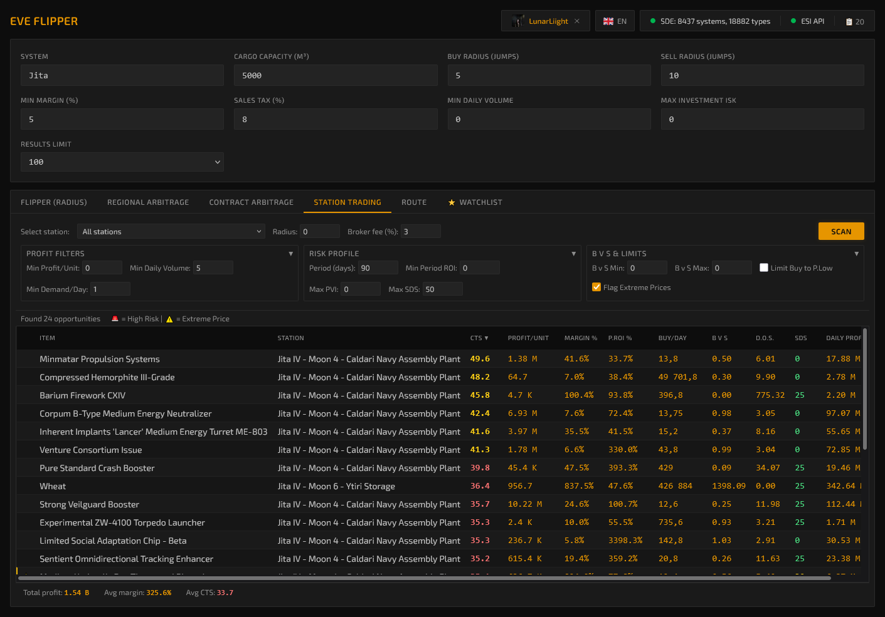
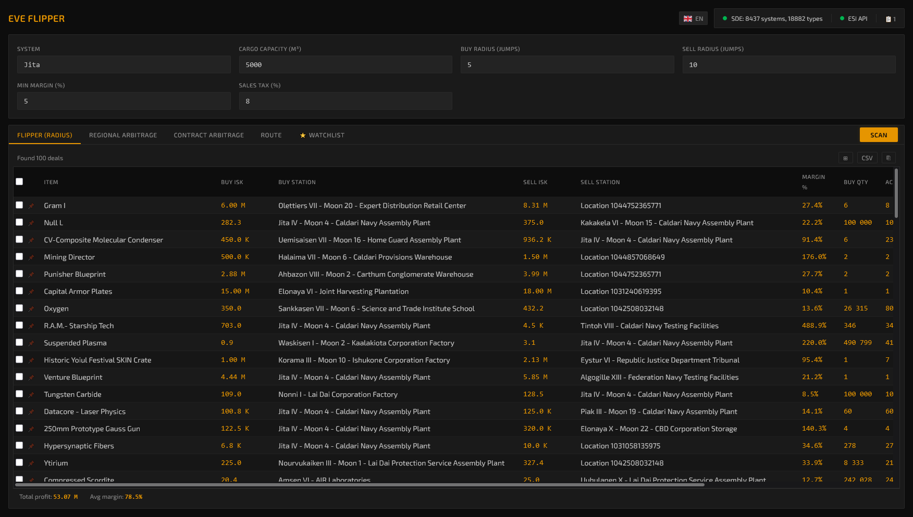

<p align="center">
  <h1 align="center">EVE Flipper</h1>
  <p align="center">
    Real-time market arbitrage scanner for EVE Online
    <br/>
    <em>Station trading &bull; Hauling &bull; Contract flipping &bull; Trade routes &bull; Industry analysis</em>
  </p>
</p>

<p align="center">
  
  
  
  
  
</p>

<p align="center">
  <a href="https://github.com/ilyaux/Eve-flipper/releases">Download</a> •
  <a href="https://github.com/ilyaux/Eve-flipper/wiki">Documentation</a> •
  <a href="https://github.com/ilyaux/Eve-flipper/issues">Issues</a>
</p>

---

EVE Flipper finds profitable station-trading and hauling opportunities by analyzing real-time market data from the [EVE Swagger Interface (ESI)](https://esi.evetech.net/ui/).

Ships as a **single executable** &mdash; frontend embedded into the Go binary. No installer, no dependencies.

## Features

| Tool | Description |
|------|-------------|
| **[Station Trading Pro](https://github.com/ilyaux/Eve-flipper/wiki/Station-Trading)** | Same-station trading with EVE Guru-style metrics (CTS, SDS, VWAP, PVI) |
| **[Radius Scan](https://github.com/ilyaux/Eve-flipper/wiki/Radius-Scan)** | Find flips within jump radius |
| **[Region Arbitrage](https://github.com/ilyaux/Eve-flipper/wiki/Region-Arbitrage)** | Cross-region price differences |
| **[Contract Scanner](https://github.com/ilyaux/Eve-flipper/wiki/Contract-Scanner)** | Evaluate public contracts vs market with VWAP-based scam detection |
| **[Route Builder](https://github.com/ilyaux/Eve-flipper/wiki/Route-Trading)** | Multi-hop trade routes |
| **[Industry Chain Optimizer](https://github.com/ilyaux/Eve-flipper/wiki/Industry-Chain-Optimizer)** | 🆕 Analyze production chains: ore → minerals → components → ship |
| **[Watchlist](https://github.com/ilyaux/Eve-flipper/wiki/Watchlist)** | Track items with margin alerts |

### Advanced
- **[Scam Detection](https://github.com/ilyaux/Eve-flipper/wiki/Scam-Detection)** &mdash; VWAP-based risk scoring, bait order detection
- **[EVE SSO Login](https://github.com/ilyaux/Eve-flipper/wiki/EVE-SSO-Login)** &mdash; View your orders, wallet, transactions, skills
- **[Advanced Metrics](https://github.com/ilyaux/Eve-flipper/wiki/Metrics-Reference)** &mdash; CTS, VWAP, PVI, OBDS, Period ROI, B v S Ratio
- **[Scan History](https://github.com/ilyaux/Eve-flipper/wiki/Scan-History)** &mdash; Save and restore previous scan results
- **[Keyboard Shortcuts](https://github.com/ilyaux/Eve-flipper/wiki/Keyboard-Shortcuts)** &mdash; Ctrl+S scan, Alt+1-5 tabs, and more

## Screenshots

<table>
  <tr>
    <td align="center"><b>Station Trading Pro</b></td>
    <td align="center"><b>Radius Scan</b></td>
    <td align="center"><b>Route Builder</b></td>
  </tr>
  <tr>
    <td><a href="assets/screenshot-station.png"></a></td>
    <td><a href="assets/screenshot-radius.png"></a></td>
    <td><a href="assets/screenshot-routes.png"></a></td>
  </tr>
</table>

<sub>Click to enlarge</sub>

### Industry Chain Optimizer (NEW)

Analyze complete production chains and compare "buy ready" vs "produce yourself":
- 📊 Material tree visualization with buy/build decisions
- 💰 Shopping list with total costs
- ⚙️ Support for ME/TE, system cost index, facility bonuses

## Quick Start

### Download

Grab the latest release for your platform from [Releases](https://github.com/ilyaux/Eve-flipper/releases):

| Platform | Binary |
|----------|--------|
| Windows (x64) | `eve-flipper-windows-amd64.exe` |
| Linux (x64) | `eve-flipper-linux-amd64` |
| Linux (ARM64) | `eve-flipper-linux-arm64` |
| macOS (Intel) | `eve-flipper-darwin-amd64` |
| macOS (Apple Silicon) | `eve-flipper-darwin-arm64` |

### Run

```bash
# Windows
eve-flipper-windows-amd64.exe

# Linux/macOS
chmod +x eve-flipper-*
./eve-flipper-linux-amd64
```

Open [http://127.0.0.1:13370](http://127.0.0.1:13370) in your browser.

> **First launch:** SDE download takes 1-2 minutes.

## Documentation

📚 **[Full documentation on Wiki](https://github.com/ilyaux/Eve-flipper/wiki)**

- [Getting Started](https://github.com/ilyaux/Eve-flipper/wiki/Getting-Started)
- [Station Trading Guide](https://github.com/ilyaux/Eve-flipper/wiki/Station-Trading)
- [Industry Chain Optimizer](https://github.com/ilyaux/Eve-flipper/wiki/Industry-Chain-Optimizer)
- [Contract Scanner](https://github.com/ilyaux/Eve-flipper/wiki/Contract-Scanner)
- [Metrics Reference](https://github.com/ilyaux/Eve-flipper/wiki/Metrics-Reference)
- [API Reference](https://github.com/ilyaux/Eve-flipper/wiki/API-Reference)
- [Building from Source](https://github.com/ilyaux/Eve-flipper/wiki/Building-from-Source)

## Building from Source

```bash
git clone https://github.com/ilyaux/Eve-flipper.git
cd Eve-flipper

# Windows
.\make.ps1 build

# Linux/macOS
make build
```

See [Building from Source](https://github.com/ilyaux/Eve-flipper/wiki/Building-from-Source) for details.

## Contributing

See [CONTRIBUTING.md](CONTRIBUTING.md) for development setup and guidelines.

## License

[MIT](LICENSE)

## Disclaimer

EVE Flipper is a third-party tool and is not affiliated with or endorsed by CCP Games. EVE Online and all related trademarks are property of CCP hf.

---

<details>
<summary>Keywords</summary>

EVE Online market tool, EVE station trading, EVE hauling calculator, EVE arbitrage scanner, EVE market flipping, EVE ISK making tool, EVE trade route finder, EVE contract scanner, EVE profit calculator, EVE market bot, EVE ESI market data, Jita market scanner, EVE market analysis, New Eden trading, EVE Online trade helper, EVE margin trading tool, EVE cross-region arbitrage, EVE multi-hop trade routes, EVE market flipper, CCP ESI API tool, EVE industry calculator, EVE production chain analyzer, EVE manufacturing cost calculator, EVE blueprint calculator, EVE buy vs build

</details>
